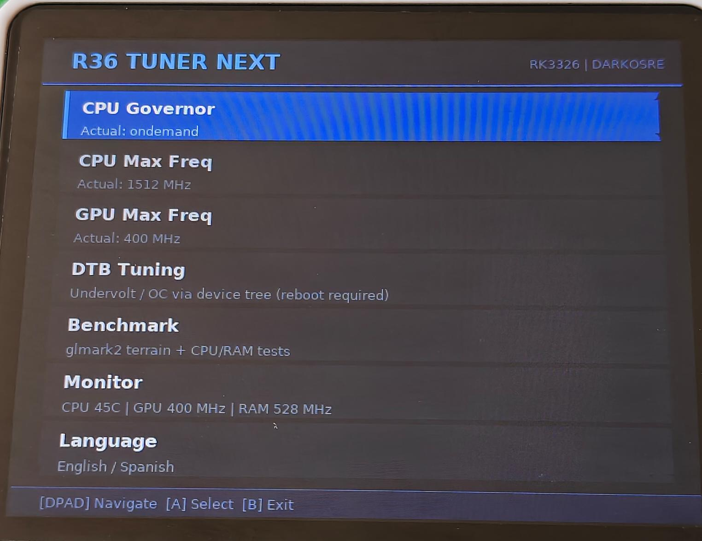
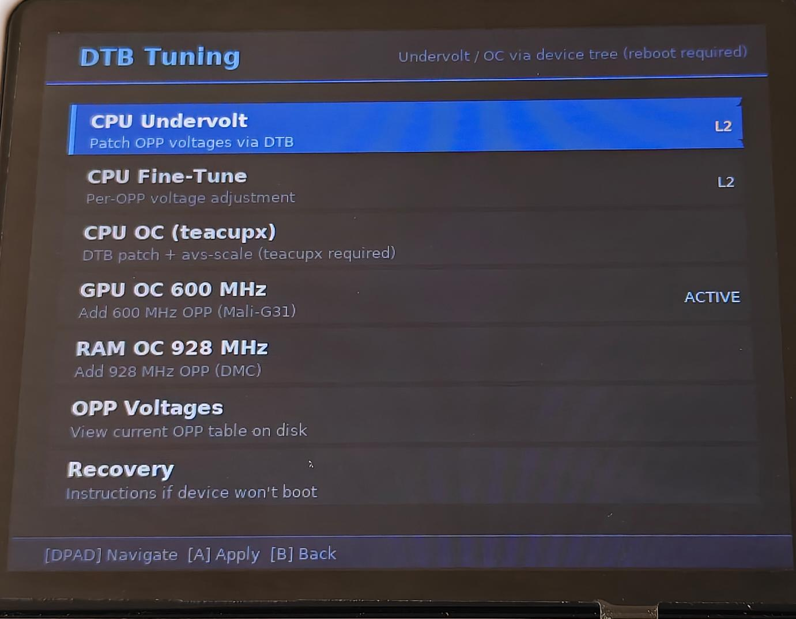
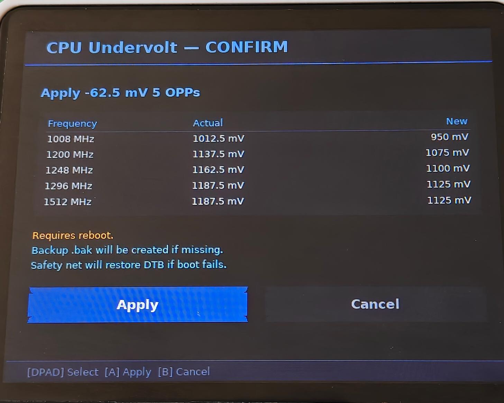
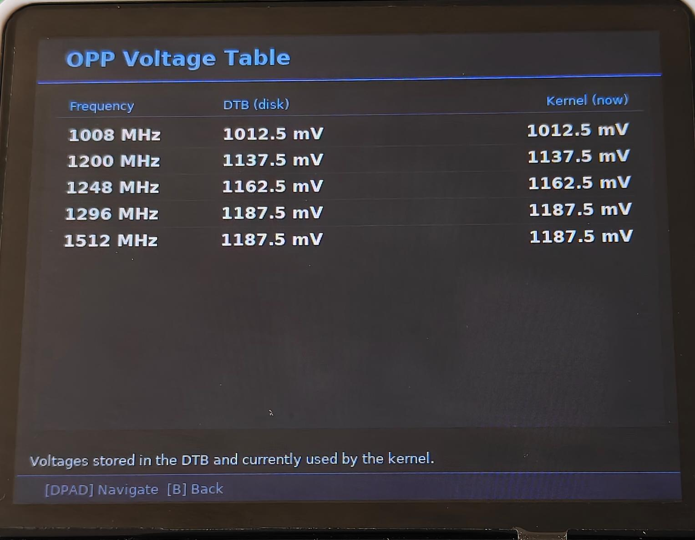
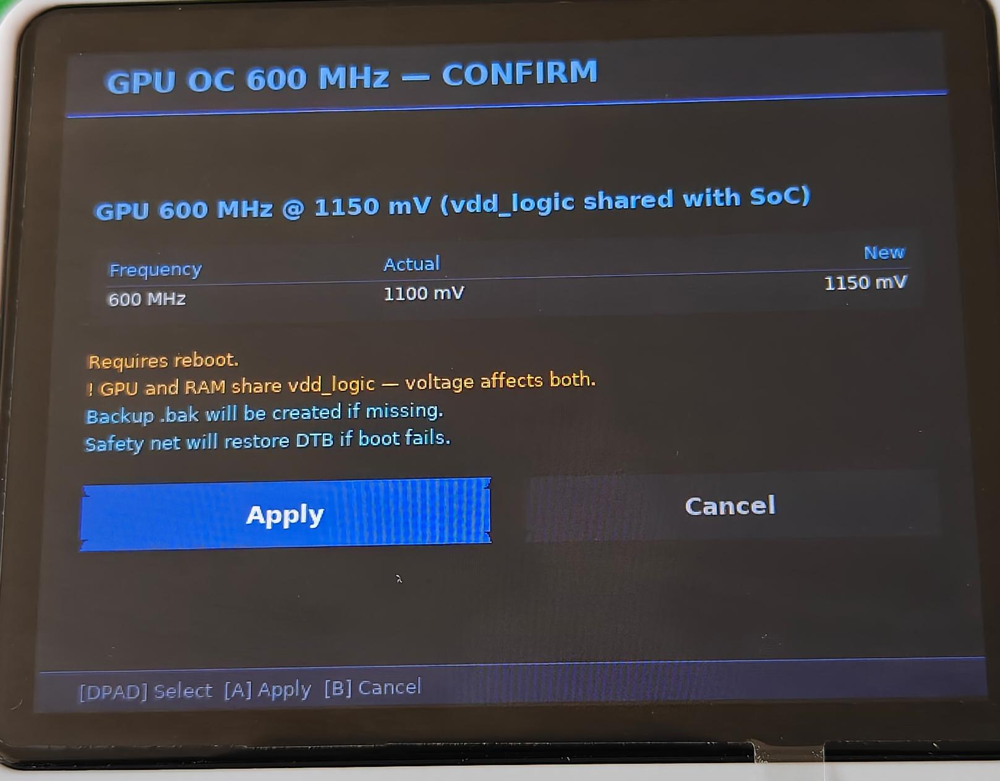
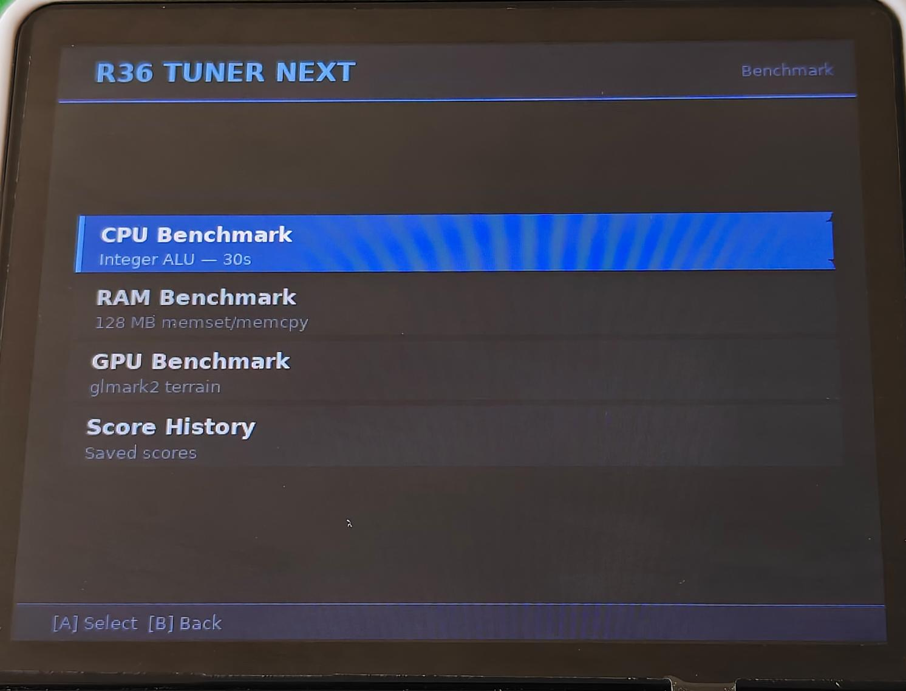
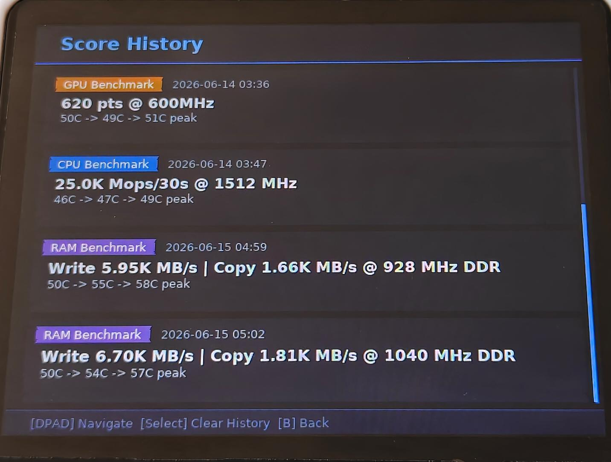
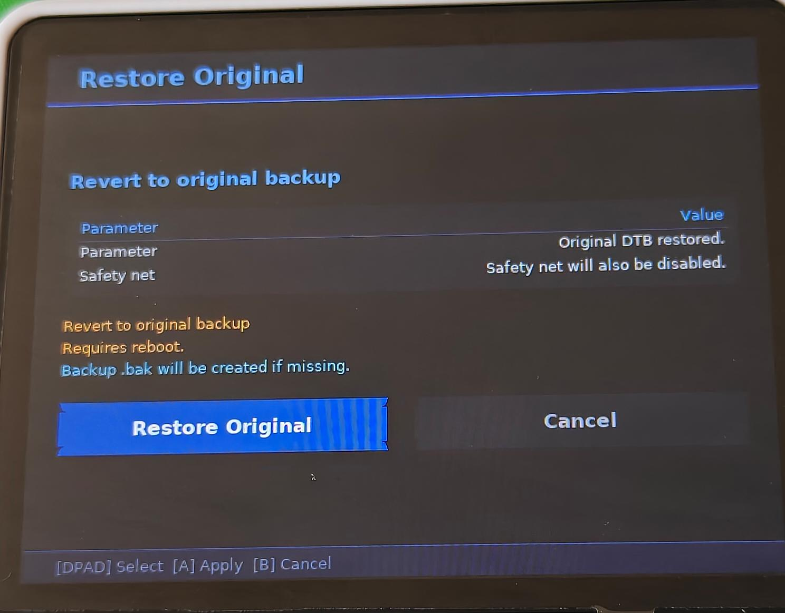

# R36 Tuner Next

[](https://github.com/zenmode-adri/r36-tuner-next/releases)
[](https://github.com/zenmode-adri/r36-tuner-next/stargazers)
[](https://ko-fi.com/zenmodeadri)

Graphical tuner for R36S and compatible RK3326 devices running [dArkOSRE-R36](https://github.com/southoz/dArkOSRE-R36). Native SDL2 UI — no terminal, no dialog boxes. Runs directly from the dArkOSRE system menu.

---

## Features

### Frequencies & Governor
- CPU max / min frequency and governor selection
- GPU max frequency selection (Mali-G31 MP2)

### DTB Tuning (permanent, reboot required)
- **CPU undervolt** — reduce CPU voltages across all frequency steps. Auto-detects your chip bin (L0–L3).
- **CPU fine-tune** — set voltage per individual frequency step (1008 / 1200 / 1248 / 1296 / 1512 MHz).
- **CPU OC** — requires [teacupx kernel](https://github.com/teacupx/overclock-r36s) installed separately. Max real freq: 1512 MHz.
- **GPU OC 600 MHz** — unlocks 600 MHz on the Mali-G31.
- **RAM OC 928 MHz** — unlocks ~924 MHz on the DMC controller.
- **RAM OC 1032 MHz** [EXPERIMENTAL] — available once 924 MHz is active.
- **DTB safety net** — auto-restores original DTB if the device fails to boot after a patch.
- **OPP voltage table** — read-only view of current vs active voltages.
- **One-tap restore** — reverts to original DTB from inside the app.

### Benchmarks
- **CPU** — 30s integer ALU benchmark with live temperature tracking.
- **RAM** — 128 MB bandwidth test (write + copy MB/s) with DDR MHz and temperatures.
- **GPU** — glmark2 off-screen (4 scenes), live progress screen. Score logged with GPU MHz and temperatures.
- **Score history** — all results saved with date, type and temperature range.

### Monitor & UX
- Real-time monitor: CPU temp, GPU MHz, RAM MHz
- Overheat warning at ≥ 80 °C
- English / Spanish, persisted across sessions
- Confirmation screens before every DTB patch
- Detects if CPU frequencies above 1296 MHz are real (teacupx) or software-only (stock kernel)

### CPU OC + teacupx

CPU overclocking above 1296 MHz is made possible by [teacupx/overclock-r36s](https://github.com/teacupx/overclock-r36s) — a patched kernel that removes the RK3326 binning restriction and adds OPPs up to 1512 MHz. Install it first, then use R36 Tuner Next to fine-tune voltages at each unlocked frequency step and find your chip's stable floor.

---

## Screenshots

<table>
<tr>
<td align="center"><br/><sub>Main menu</sub></td>
<td align="center"><br/><sub>DTB Tuning menu</sub></td>
<td align="center"><br/><sub>CPU undervolt — confirm screen</sub></td>
<td align="center"><br/><sub>OPP voltage table</sub></td>
</tr>
<tr>
<td align="center"><br/><sub>GPU OC 600 MHz — confirm</sub></td>
<td align="center"><br/><sub>Benchmark menu</sub></td>
<td align="center"><br/><sub>Score history</sub></td>
<td align="center"><br/><sub>Restore original DTB</sub></td>
</tr>
</table>

---

## Requirements

- **Device:** R36S or compatible RK3326 / RK3326S clone
- **OS:** [dArkOSRE-R36](https://github.com/southoz/dArkOSRE-R36) by southoz
- **Dependencies:** none — everything is bundled in the launcher

---

## Installation

Download **`tuner_ui`** and **`R36 Tuner Next.sh`** from the [latest release](https://github.com/zenmode-adri/r36-tuner-next/releases/latest). Copy both files to `/opt/system/` on the device.

**Option A — SSH (recommended)**
```bash
scp tuner_ui "R36 Tuner Next.sh" ark@<device-ip>:/opt/system/
ssh ark@<device-ip> "chmod +x /opt/system/tuner_ui '/opt/system/R36 Tuner Next.sh'"
```

**Option B — SD card + file manager (no network needed)**

Copy both files to the **FAT32 partition** of the SD card (visible on any PC). Insert the card, boot the device, open a file manager (e.g. **351Files**) and move both files to `/opt/system/`. They will appear in the dArkOSRE system menu.

**First launch:** extracts bundled tools (`fdtget`, `fdtput`, benchmarks, glmark2) — takes ~30 seconds, one time only.

---

## Tested results (L2 bin)

| Component | Stock | OC + UV |
|-----------|-------|---------|
| CPU (vdd_arm) | 1300 mV @ 1296 MHz | 1175 mV — OC requires [teacupx](https://github.com/teacupx/overclock-r36s) |
| GPU (vdd_logic) | 1100 mV @ 520 MHz | 1025 mV @ 600 MHz |
| RAM (vdd_logic) | ~1025 mV @ 786 MHz | 987.5 mV @ 924 MHz |

> Results represent one chip. Silicon lottery applies.
> Full voltage tables for all bins: [docs/opp-research.md](https://github.com/zenmode-adri/r36-tuner/blob/master/docs/opp-research.md)

**GPU and RAM share the `vdd_logic` rail** — to benefit from undervolting both, each must be set below your target. Undervolting only one won't lower the effective rail if the other demands more.

### RAM OC 1032 MHz

| DMC freq | FPS avg (PPSSPP) | vs stock |
|----------|--------:|---------:|
| 786 MHz (stock) | 25.6 | — |
| 924 MHz | 26.7 | +4% |
| **1032 MHz** | **28.6** | **+12%** |

Requires **1150 mV** on `vdd_logic` (PMIC ceiling — no UV margin at this frequency).

### GPU OC glmark2

| Config | Score | GPU MHz | Peak temp |
|--------|------:|--------:|----------:|
| Stock | 560 pts | 520 MHz | 51 °C |
| GPU OC | **620 pts** | **600 MHz** | 51 °C |

> Test unit has thermal pad + active fan. GPU undervolt offsets the extra heat from OC — temps stay close to stock.

---

## Emergency Recovery

If a DTB patch causes a hard boot failure:

1. Power off, remove the SD card
2. Open the **FAT32 partition** on a PC and copy `rk3326-r36s-linux.dtb.bak` → `rk3326-r36s-linux.dtb`
3. Delete `.r36_dtb_patch_booting` if it exists
4. Reinsert, boot

---

## Disclaimer

> **USE AT YOUR OWN RISK.** This tool patches the Device Tree Binary and modifies CPU, GPU, and RAM voltages. The authors take no responsibility for bricked devices or data loss.

---

## Credits

Built for [dArkOSRE-R36](https://github.com/southoz/dArkOSRE-R36) by [southoz](https://github.com/southoz).

## License

[MIT](LICENSE)
